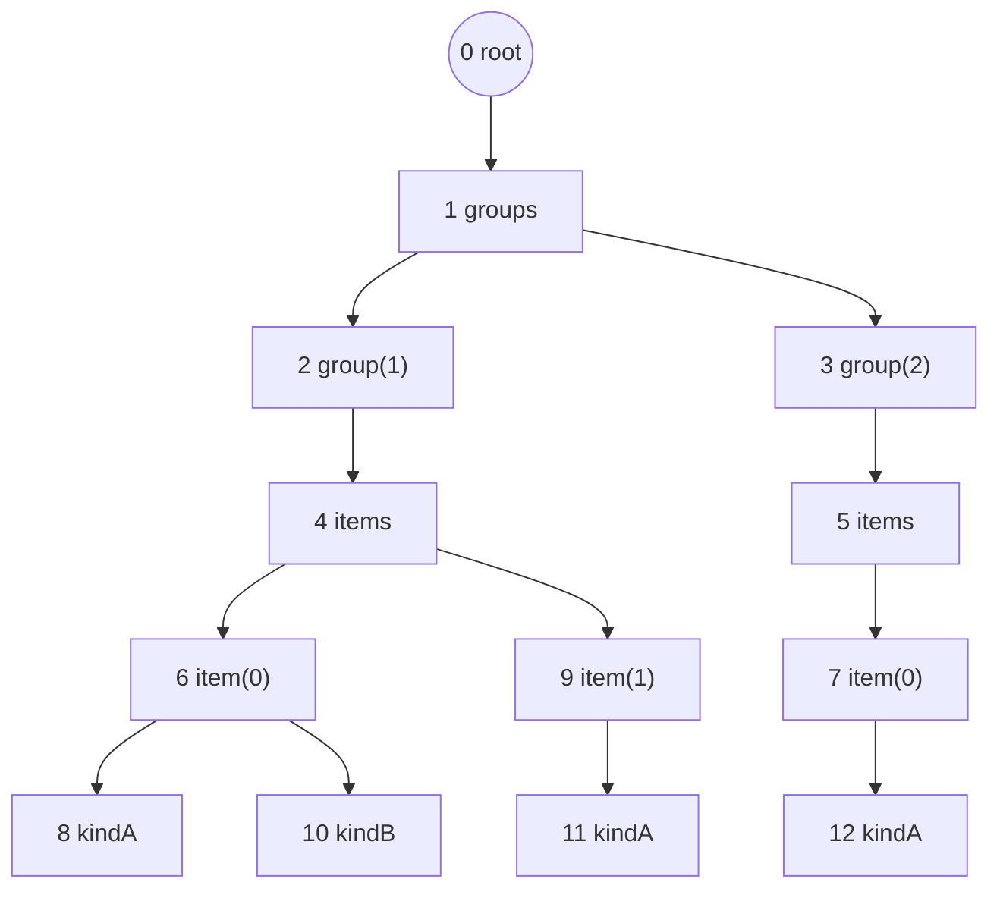

# 2. Сквозной пример

Дерево из 13 узлов, используемое как единый пример во всех файлах этого конспекта: контейнер `groups` с двумя `group(N)`, у каждой группы — контейнер `items` с одним-двумя `item(N)`, а у каждого `item` — до одного `kindA` и до одного `kindB` (два независимых, взаимоисключающих по смыслу вида листьев).



Номер узла — это его **id**, он же позиция в массивах. Нумерация соответствует **порядку создания**: узлы приходят от нескольких параллельных потоков-производителей, поэтому дети одного родителя не обязаны идти подряд (у узла 4 дети — 6 и 9, между ними вклинились узлы 7 и 8 из другой ветки). Это типичная ситуация при конкурентной/инкрементальной записи дерева, и именно она делает переупорядочение ([`07-dfs-order.md`](07-dfs-order.md), [`08-bfs-order.md`](08-bfs-order.md)) нетривиальным.

| id | узел | `parent` | `sibling` | `depth` | `rank` |
|---:|------|---------:|----------:|--------:|-------:|
| 0  | root       | 0 | 0  | 0 | 0 |
| 1  | groups     | 0 | 1  | 1 | 0 |
| 2  | group(1)   | 1 | 2  | 2 | 0 |
| 3  | group(2)   | 1 | 2  | 2 | 1 |
| 4  | items      | 2 | 4  | 3 | 0 |
| 5  | items      | 3 | 5  | 3 | 0 |
| 6  | item(0)    | 4 | 6  | 4 | 0 |
| 7  | item(0)    | 5 | 7  | 4 | 0 |
| 8  | kindA      | 6 | 8  | 5 | 0 |
| 9  | item(1)    | 4 | 6  | 4 | 1 |
| 10 | kindB      | 6 | 8  | 5 | 1 |
| 11 | kindA      | 9 | 11 | 5 | 0 |
| 12 | kindA      | 7 | 12 | 5 | 0 |

Соглашения:

- `parent[i] == i` — узел является корнем;
- `sibling[i] == i` — узел является первым ребёнком своего родителя (нет левого соседа);
- `depth` и `rank` (порядковый номер среди братьев, с нуля) **не хранятся** — это производные величины ([`03-derived-vectors.md`](03-derived-vectors.md)).

Позиция узла в массиве при этом структурного смысла не несёт: то же самое дерево можно записать в любом другом порядке, в том числе с корнем не в нулевой ячейке ([`06-permutations.md`](06-permutations.md) §7.4). Порядок создания — соглашение конкретной системы, а не требование самого представления.

В виде векторов:

```
id      =  0  1  2  3  4  5  6  7  8  9 10 11 12
parent  =  0  0  1  1  2  3  4  5  6  4  6  9  7
sibling =  0  1  2  2  4  5  6  7  8  6  8 11 12
depth   =  0  1  2  2  3  3  4  4  5  4  5  5  5
rank    =  0  0  0  1  0  0  0  0  0  1  1  0  0
```
