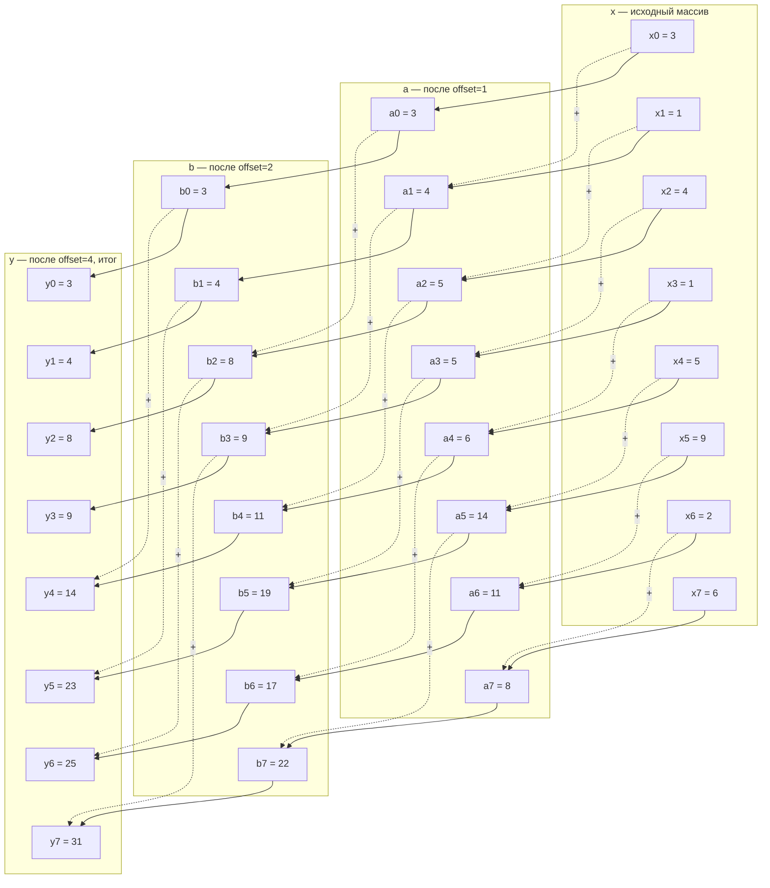

# 5. Распространение маски по вектору `parent`

Маска — булев (или битовый) вектор длины `n`: «этот узел отобран». Типовые задачи: «пометить всё поддерево узла X», «пометить всех предков узлов, попавших в результат поиска», «пометить ветки с неизвестным типом, чтобы пропустить их целиком».

## 5.1. Вниз: от родителей к детям

Правило: узел получает метку, если она есть у него самого или у его родителя.

```
m[i] = m[i] or m[parent[i]]
```

Одно применение продвигает маску **на один уровень**. Повторяем, пока маска меняется.

Пример (дерево — [«01. Сквозной пример»](01-example-tree.md)): установим маску в узле 2 (`group(1)`) и распространим вниз. Итерации (синхронные — все чтения из состояния предыдущего шага):

| Итерация | Помеченные узлы | Изменения |
|---------:|-----------------|-----------|
| старт | `{2}` | — |
| 1 | `{2, 4}` | да |
| 2 | `{2, 4, 6, 9}` | да |
| 3 | `{2, 4, 6, 8, 9, 10, 11}` | да |
| 4 | `{2, 4, 6, 8, 9, 10, 11}` | нет → стоп |

Результат — всё поддерево узла 2. Число итераций — высота поддерева ниже отмеченного узла (здесь 3) плюс одна на обнаружение сходимости.

Самоссылка корня здесь работает бесплатно: для корня правило вырождается в `m[root] = m[root] or m[root]`, то есть в тождество. Никакой проверки «а не корень ли это» не нужно (важное следствие — [`05-propagation-pattern.md`](05-propagation-pattern.md) §6.3).

## 5.2. Вверх: от детей к родителям

Правило зеркальное, но это уже не gather, а **scatter с редукцией**: в одну ячейку `parent[i]` пишут несколько разных `i`, поэтому операция обязана быть коммутативной и ассоциативной (`or`, `and`, `min`, `max`, `+`).

```
m[parent[i]] = m[parent[i]] or m[i]
```

Пример: установим маску в узле 10 (`kindB`) и распространим вверх.

| Итерация | Помеченные узлы |
|---------:|-----------------|
| старт | `{10}` |
| 1 | `{6, 10}` |
| 2 | `{4, 6, 10}` |
| 3 | `{2, 4, 6, 10}` |
| 4 | `{1, 2, 4, 6, 10}` |
| 5 | `{0, 1, 2, 4, 6, 10}` |
| 6 | без изменений → стоп |

Результат — цепочка предков узла 10.

!!! note "Когда `or`/`and`/`+` недостаточно"
    Здесь объединяющая операция коммутативна и ассоциативна (`or`) — неважно, в каком порядке и сколько раз она применится к одной ячейке `m[parent[i]]`. Если результат — не бит, а произвольное значение, для которого порядок детей значим (например, хеш Меркла, где `H(a∥b) != H(b∥a)`), одной общей ячейки-аккумулятора недостаточно: нужен персональный, заранее известный слот на каждого ребёнка.

## 5.3. Один проход вместо итераций: топологическая нумерация

Итерации нужны только тогда, когда порядок узлов в массиве произволен. Но если действует инвариант `parent[i] <= i` (родитель физически создан раньше ребёнка), массив уже топологически отсортирован. Тогда:

- **вниз** — достаточно **одного прохода по возрастанию `i`**: когда мы доходим до `i`, ячейка `parent[i]` уже в финальном состоянии;
- **вверх** — достаточно **одного прохода по убыванию `i`**.

```go
// вниз: один проход, требует parent[i] <= i
func propagateDown(mask []bool, parent []uint32) {
	for i := range mask {
		mask[i] = mask[i] || mask[parent[i]]
	}
}

// вверх: один проход, требует parent[i] <= i
func propagateUp(mask []bool, parent []uint32) {
	for i := len(mask) - 1; i >= 0; i-- {
		if mask[i] {
			mask[parent[i]] = true
		}
	}
}
```

Проверено на примере: `propagateDown` от `{2}` даёт `{2, 4, 6, 8, 9, 10, 11}` за один проход, `propagateUp` от `{10}` даёт `{0, 1, 2, 4, 6, 10}` за один проход — те же результаты, что и итеративные версии выше.

!!! note "Цена односкоростного прохода"
    Однопроходная версия **последовательна**: `mask[i]` зависит от `mask[parent[i]]`, вычисленного на этом же проходе. Это цепочка зависимостей — её нельзя векторизовать или раздать по ядрам. Итеративная версия (§5.1) внутри одной итерации полностью параллельна и SIMD-дружественна, но требует до `d` итераций. Выбор: `1 × O(n)` последовательно против `d × O(n)` параллельно.

## 5.4. Pointer doubling: `O(log d)` вместо `O(d)`

Если нужен параллельный вариант, но `d` велика, число итераций снижается с `O(d)` до `O(log d)` удвоением указателей (pointer jumping, [`13-sources.md`](13-sources.md) §17.2): вместо «сделать шаг к родителю» — «сделать шаг к предку вдвое дальше».

```
A = parent
повторять:
    m = m or m[A]         // подтянуть маску от предка на расстоянии A
    A = A[A]              // удвоить дальность прыжка
```

Векторы предков для примера (`A1 = parent`, `A2 = A1[A1]`, `A4 = A2[A2]`):

```
id  =  0  1  2  3  4  5  6  7  8  9 10 11 12
A1  =  0  0  1  1  2  3  4  5  6  4  6  9  7
A2  =  0  0  0  0  1  1  2  3  4  2  4  4  5
A4  =  0  0  0  0  0  0  0  0  1  0  1  1  1
```

Распространение вниз от `{2}` с удвоением: после шага 1 — `{2, 4}`, после шага 2 — `{2, 4, 6, 8, 9, 10, 11}` (полный результат). Две итерации вместо трёх; на дереве глубины 1000 — 10 итераций вместо 1000.

Заметьте, что самоссылка корня и здесь работает сама: `A[A]` для корня остаётся корнем, векторы предков просто «упираются» в корень и насыщаются.

### Сколько раундов и когда останавливаться

Дальность прыжка `A` (и `offset` в аналогии ниже) — это степени двойки: `2⁰=1, 2¹=2, 2²=4, 2³=8, …`, каждый раунд ровно вдвое больше предыдущего. Число раундов ограничено тем, что нужно покрыть:

- **Общая формула** — `⌈log₂ d⌉` раундов (`d` — глубина дерева), плюс-минус один в зависимости от того, считать ли запас на самом краю. Для примера выше (`d = 5`) построены `A1, A2, A4` (три таблицы, `k = 0, 1, 2`): суммарный запас хода `1 + 2 + 4 = 7 ≥ 5` — с небольшим запасом.
- Конкретный запрос может сойтись раньше общего предела: распространение от `{2}` заняло 2 шага (`A1`, затем `A2`), а не 3, потому что от узла 2 до самого глубокого потомка в его поддереве — не 5, а 3 уровня. Общая формула даёт **достаточное**, а не всегда **минимальное** число раундов.

Раунды сверх нужного не портят результат — только тратят время впустую:

- как только дальность прыжка долетает до корня, дальнейшее удвоение (`A[A]`) держит её в корне навсегда (самоссылка `parent[root] = root`), а повторный `or` с тем же значением ничего не меняет (идемпотентность, [«05. Propagation pattern»](05-propagation-pattern.md) §6.3).

Поэтому на практике не обязательно высчитывать точное число раундов под каждый конкретный запрос — берут `⌈log₂ d_max⌉` с небольшим запасом на всё дерево сразу, и «лишние» раунды просто ничего не портят.

### Почему это работает: аналогия с Hillis–Steele scan

Механизм удвоения — не специфика деревьев: это тот же приём, что в классическом параллельном prefix scan Hillis–Steele ([«13. Источники»](13-sources.md) §17.3, видео «Hillis Steele vs Blelloch Scan»). Каждый раунд не продвигает свёртку на шаг, а **склеивает два уже готовых соседних окна в окно вдвое длиннее** — поэтому раундов нужно `log₂` от длины, а не сама длина.

Разберём на плоском массиве, `⊕ = +`, индексация с 0: `x = [3, 1, 4, 1, 5, 9, 2, 6]`.

Все три раунда сразу (сплошная стрелка — «слагаемое остаётся как есть», пунктирная со знаком `+` — «слагаемое добавляется издалека, с расстояния `offset`»):



Окно достигло длины 8 = `n` в строке `y`, значит `y` — это уже точная префиксная сумма всего `x`. Закономерность по раундам: в раунде 1 пунктир идёт от соседа на расстоянии 1, в раунде 2 — на расстоянии 2, в раунде 3 — на расстоянии 4 (`offset` удваивается, как и `A` в примере с деревом выше). Первые `offset` ячеек в каждом раунде получают только сплошную стрелку — им ещё не с чем складываться слева, поэтому их значение переносится без изменений. Проверка: обычная последовательная префиксная сумма `x` даёт `[3, 4, 8, 9, 14, 23, 25, 31]` — совпадает с `y` после 3 раундов (`⌈log₂ 8⌉ = 3`, то же правило остановки, что и для дерева выше — раунд после этого стал бы no-op, поскольку `offset ≥ n`).

Разница с деревом только в том, что «массив» здесь плоский (`x[i-offset]` — сосед слева по индексу), а на дереве — это путь к корню (`m[A[i]]` — предок на расстоянии `offset`, найденный через таблицу прыжков). Механизм склейки окон один и тот же.
